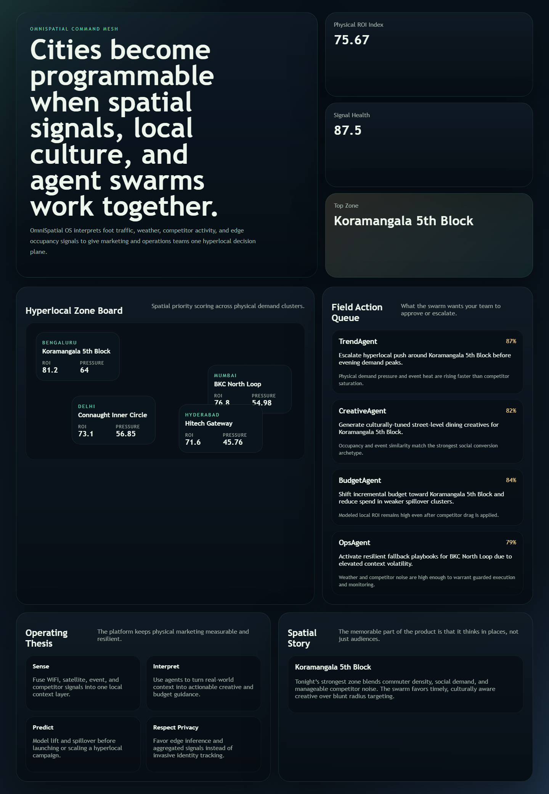

# omnispatial-os

Hyperlocal multi-agent operating system for **physical marketing intelligence**, **spatial ROI forecasting**, and **privacy-aware edge decisioning**.



[](https://www.python.org/)
[](https://react.dev/)
[](LICENSE)
[](.github/workflows/ci.yml)

`omnispatial-os` is a spatially aware, agentic operating system for teams that need to turn cities, districts, malls, airports, stadiums, and transport hubs into measurable, programmable marketing surfaces.

## What It Solves

- physical environments are hard to measure compared with digital campaigns
- hyperlocal campaigns usually react too slowly to real-world changes
- physical signals are noisy, intermittent, and privacy-sensitive
- teams need one system that combines spatial sensing, causal reasoning, and channel execution recommendations

## Verified Runtime Surface

The verified runtime in this environment includes:

- a Python spatial intelligence engine in [src/omnispatial_os](src/omnispatial_os)
- a FastAPI control plane in [services/omnispatial_api/app/main.py](services/omnispatial_api/app/main.py)
- a React command center in [frontend-dashboard/src/App.tsx](frontend-dashboard/src/App.tsx)
- tests, live API smoke, and browser screenshot capture in [tests](tests)

## Platform Modules

```text
omnispatial-os/
├── spatial-core/         # Rust spatial signal processing surface
├── agent-swarm/          # Python agent design and operational surfaces
├── orchestrator/         # Rust coordination runtime
├── causal-engine/        # spatial what-if and uplift reasoning
├── api-gateway/          # Go edge gateway
├── frontend-dashboard/   # React + TypeScript command center
├── mobile/               # Swift + Kotlin field marketer companions
├── edge-runtime/         # WebAssembly and C++ edge inference surfaces
├── infrastructure/       # Helm / deployment assets
├── data-pipeline/        # Scala historical processing
├── sql/                  # PostGIS-style data surfaces
├── services/omnispatial_api/
└── src/omnispatial_os/
```

## API Surface

- `GET /health`
- `GET /api/overview`
- `GET /api/zones`
- `GET /api/agents`
- `GET /api/signals`
- `POST /api/what-if`
- `POST /api/train`

## Quick Start

```bash
python -m venv .venv
.venv\Scripts\activate
pip install -r requirements.txt
npm --prefix frontend-dashboard install
python -m uvicorn services.omnispatial_api.app.main:app --host 127.0.0.1 --port 8036
npm --prefix frontend-dashboard run dev
```

## Verification

```bash
python -m pytest tests -q
python -m compileall services src tests
npm --prefix frontend-dashboard run build
```

## Docs

- [Architecture](docs/architecture.md)
- [Final audit](docs/final-audit.md)
- [Contributing](CONTRIBUTING.md)
- [Security policy](SECURITY.md)
- [Authors](AUTHORS.md)

